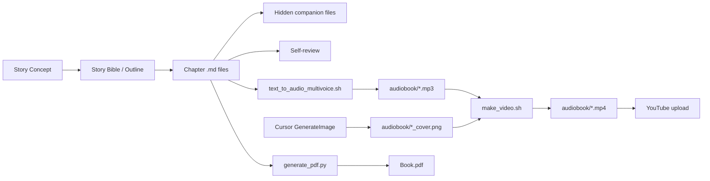

# Story Creation Playbook

Complete pipeline: **concept → chapters → audiobook → YouTube**.

---

## Pipeline Overview



---

## Phase 1: Story Creation

### 1.1 — Story Bible

Create a `story_bible.md` with:
- Premise / logline (1-2 sentences)
- Themes and motifs
- World rules and constraints
- Act structure (3-act or custom)
- Chapter outline (title + 2-3 sentence summary each)
- Character roster (name, role, voice traits, arc)
- Timeline / key events

### 1.2 — Writing Style Rules

Define and enforce consistent style rules across all chapters:
- Show, don't tell — no exposition dumps
- Distinct character voices (define per character)
- Trust the reader — plant seeds, never explain significance
- Literary prose style (define your target: e.g., Vonnegut, Ishiguro, etc.)
- Consistent POV and tense

### 1.3 — Chapter Files

**Naming:** `{NN}_{snake_case_title}.md` (zero-padded)

```
00_prologue.md
01_first_chapter.md
02_second_chapter.md
...
```

**Structure:**
```markdown
# Chapter N: Title

---

Prose body...

---

More prose...
```

- Use `---` horizontal rules for section breaks
- Standard markdown formatting (bold, italic, inline code)
- No YAML frontmatter needed

### 1.4 — Hidden / Companion Files (Optional)

**Naming:** `{NN}_{title}_hidden_file.md`

Template sections:
1. **Behind-the-Scenes Log** — off-page events
2. **Author's Notes** — world-building context
3. **Parallel Events** — alternate outcomes or simultaneous action
4. **Character Secrets** — unrevealed backstory
5. **Subplot Thread** — parallel storyline details
6. **Foreshadowing Register** — seed → payoff mapping table

### 1.5 — Self-Review

Create `review.md` after completing all chapters:
- Word counts per chapter (table)
- Total word count
- Theme analysis
- Strengths / weaknesses
- Rating and areas for improvement

---

## Phase 2: Audiobook (Text-to-Speech)

### Prerequisites
- AWS CLI configured (`aws configure`)
- Amazon Polly access in `us-east-1`
- `python3` installed
- `ffmpeg` installed (`brew install ffmpeg`)

### Voice Map

Define character-to-voice mapping in `text_to_audio_multivoice.sh`.

**Available Polly voices (generative engine):**

| Voice | Gender | Best for |
|-------|--------|----------|
| Ruth | Female | Narrator — warm, authoritative |
| Danielle | Female | Younger female characters |
| Joanna | Female | Precise, professional female |
| Salli | Female | Direct, casual female |
| Stephen | Male | Measured, calm male |
| Matthew | Male | General male characters |

> **Note:** Gregory is available on neural engine only, not generative.

### Running TTS

**Single chapter:**
```bash
./text_to_audio_multivoice.sh 01_first_chapter.md
```

**All chapters (skip hidden files):**
```bash
for f in [0-2][0-9]_*.md; do
  [[ "$f" == *hidden* ]] && continue
  ./text_to_audio_multivoice.sh "$f"
done
```

**Output:** `audiobook/{NN}_{title}.mp3`

### How the Script Works
1. Python strips markdown formatting (headers, bold, italic, code, tables, rules)
2. Detects dialogue and attributes speaker from context (±2 lines)
3. Splits into ≤2900-char segments (Polly sync limit ~3000)
4. Calls `aws polly synthesize-speech` per segment with assigned voice
5. Concatenates all parts via `ffmpeg -f concat`

### Cost Estimate
- **Generative engine:** ~$0.03 per 1000 chars
- Typical chapter (3000 words ≈ 18k chars): ~$0.54
- Full 26-chapter book (~480k chars): ~$14.40

---

## Phase 3: Cover Art

### Tool
Cursor `GenerateImage` tool — called from Cursor agent chat.

### Specifications
- **Resolution:** 2560×1440 (16:9, 2K) — YouTube optimized
- **Output:** `audiobook/{NN}_{title}_cover.png`

### Prompt Template
```
YouTube thumbnail cover image at 2560x1440 resolution for an audiobook chapter.
[Your series visual style description].

Background: [chapter-specific scene elements]

Text overlay (large, centered, clean serif font in white/silver):
- Top: "[SERIES NAME]" (small, tracking wide, silver)
- Center: "[BOOK TITLE]" (large, bold, white with subtle glow)
- Below center: "Chapter N: {Title}" (medium, italic, light grey)
- Bottom right corner: A minimal waveform/audio icon

Color palette: [your palette].
Aspect ratio 16:9 at 2560x1440 pixels.
```

### After Generation
Copy from Cursor assets cache:
```bash
cp ~/.cursor/projects/.../assets/{generated_filename}.png \
   audiobook/{NN}_{title}_cover.png
```

---

## Phase 4: Video (MP4)

### Single Chapter
```bash
./make_video.sh 01_first_chapter
```

### All Chapters
```bash
for mp3 in audiobook/*.mp3; do
  base=$(basename "$mp3" .mp3)
  [[ -f "audiobook/${base}_cover.png" ]] || continue
  ./make_video.sh "$base"
done
```

### Output Specs
- **Resolution:** 1920×1080 (1080p)
- **Video codec:** H.264 (`libx264`, `stillimage` tune)
- **Audio codec:** AAC 192 kbps
- **Pixel format:** `yuv420p` (YouTube-compatible)
- **File:** `audiobook/{NN}_{title}.mp4`

---

## Phase 5: PDF (Optional — Print Edition)

### Run
```bash
python3 generate_pdf.py
```

### Dependencies
```bash
pip install fpdf2
```

### Specs
- Trim: 5.5 × 8.5 in (trade paperback)
- Font: Times New Roman (macOS system)
- Includes: half-title, title page, copyright, epigraph, TOC, all chapters

---

## Phase 6: YouTube Upload

**Currently manual** — upload via YouTube Studio.

Per video, prepare:
- **Title:** `[Series] Book N — Chapter NN: Title | Audiobook`
- **Description:** Chapter summary, series info, playlist link
- **Tags:** audiobook, sci-fi, [genre], [series name], chapter N
- **Thumbnail:** Use the `_cover.png` (already 16:9)
- **Playlist:** Add to series playlist

---

## File Naming Reference

| Asset | Pattern | Example |
|-------|---------|---------|
| Chapter | `{NN}_{title}.md` | `01_first_chapter.md` |
| Hidden file | `{NN}_{title}_hidden_file.md` | `01_first_chapter_hidden_file.md` |
| Audio | `audiobook/{NN}_{title}.mp3` | `audiobook/01_first_chapter.mp3` |
| Cover | `audiobook/{NN}_{title}_cover.png` | `audiobook/01_first_chapter_cover.png` |
| Video | `audiobook/{NN}_{title}.mp4` | `audiobook/01_first_chapter.mp4` |
| PDF | `{Book_Title}.pdf` | `My_Book.pdf` |

---

## Dependencies Checklist

| Tool | Purpose | Install |
|------|---------|---------|
| bash | Scripts | system |
| python3 | Markdown processing, PDF | system |
| AWS CLI | Polly TTS | `brew install awscli` + `aws configure` |
| Amazon Polly | Text-to-speech API | AWS account |
| ffmpeg | Audio concat + video creation | `brew install ffmpeg` |
| fpdf2 | PDF generation | `pip install fpdf2` |
| Cursor IDE | Cover art (GenerateImage) | — |

---

## Quick Start Checklist

- [ ] Create `story_bible.md`
- [ ] Define writing style rules
- [ ] Write all chapter `.md` files
- [ ] Write hidden companion files (optional)
- [ ] Create `review.md`
- [ ] Configure voice map in `text_to_audio_multivoice.sh`
- [ ] Run TTS for all chapters
- [ ] Generate cover art for all chapters
- [ ] Run `make_video.sh` for all chapters
- [ ] Generate PDF (optional)
- [ ] Upload to YouTube
